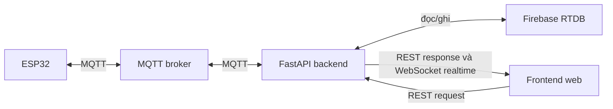

# Tổng quan hệ thống GymTag



GymTag tách phần cứng, nghiệp vụ và giao diện thành ba lớp. ESP32 đọc cảm biến/thẻ và điều khiển GPIO; backend quyết định quyền ra vào, phân bổ locker và điều khiển quạt; Firebase lưu trạng thái; frontend chỉ giao tiếp với backend.

## Thành phần và trách nhiệm

| Thành phần | Trách nhiệm | Điểm vào chính |
|---|---|---|
| ESP32 | RFID locker, LCD, 3 servo/door switch, DHT22, quạt | `esp32/src/main.cpp` |
| MQTT broker | Chuyển message giữa ESP32 và backend | `test.mosquitto.org:1883` trong firmware |
| FastAPI backend | Luật nghiệp vụ, REST, MQTT handler, WebSocket | `lifespan()` trong `backend/app/main.py` |
| Firebase RTDB | Member, locker, log, môi trường và ngưỡng | `FirebaseRepository` |
| REST API | Tải ban đầu, CRUD và lệnh từ web | `frontend/shared/js/api.js` |
| WebSocket | Đẩy thay đổi realtime xuống dashboard | Backend broadcast, frontend listener |
| Frontend | Hiển thị public/user/admin | REST snapshot và WebSocket event |

## Trả lời nhanh về kiến trúc

- **Frontend giao tiếp trực tiếp ESP32 không?** Không; frontend chỉ gọi FastAPI bằng REST/WebSocket.
- **ESP32 truy cập Firebase trực tiếp không?** Không; ESP32 chỉ dùng MQTT.
- **Luật cấp locker nằm ở đâu?** `LockerService`; ESP32 chỉ gửi UID và thực thi response hợp lệ.
- **MQTT dùng hướng nào?** Hai chiều giữa ESP32 và backend.
- **REST dùng hướng nào?** Browser gửi request đến backend và nhận response.
- **WebSocket dùng hướng nào?** Backend đẩy realtime xuống browser; browser chỉ gửi `ping` để nhận `pong`.

## Trạng thái triển khai phần cứng

| Chức năng | Trạng thái theo source |
|---|---|
| DHT22 GPIO 15 | Đã triển khai và có trong Wokwi |
| Quạt/LED GPIO 12 | Đã triển khai và có trong Wokwi |
| RC522 GPIO 21/4 | Firmware đã triển khai, Wokwi chưa nối |
| Servo locker | Đã triển khai 3 servo: GPIO 26/27/32, 0° locked và 90° unlocked |
| Door switch | Đã triển khai 4 button: GPIO 13/14/16/17, pressed/LOW là closed |
| Nút release | Đã triển khai GPIO33, active-low với `INPUT_PULLUP` |
| RFID cửa check-in/out | Backend có protocol; firmware hiện tại chưa có module |

## Cấu trúc thư mục

```text
backend/   API, model, MQTT, repository và service
frontend/  giao diện public, user, admin và mã dùng chung
esp32/     header, cấu hình phần cứng và firmware
docs/      tài liệu hệ thống
```

## Đọc tiếp

[Luồng end-to-end](01_END_TO_END_FLOW.md) · [Giao thức MQTT](02_MQTT_PROTOCOL.md) · [Mô hình dữ liệu](03_DATA_MODEL.md) · [Luồng locker](modules/locker/FLOW.md)
