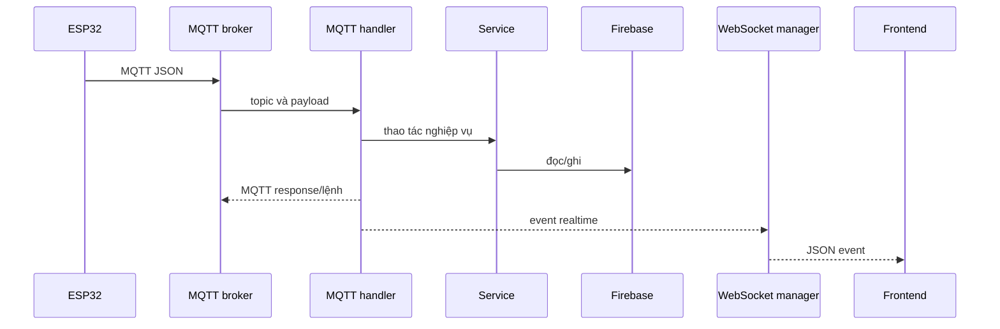
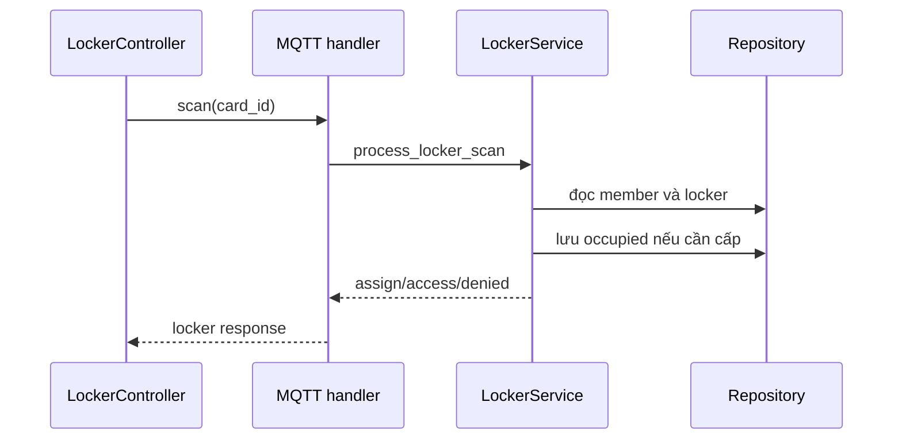

# Luồng end-to-end của GymTag

## Chuỗi thành phần

## Yêu cầu RFID locker

1. `loop()` gọi `LockerRfid::readCard(cardId)` và chuẩn hóa UID uppercase.
2. `LockerController::handleCardScan()` chỉ nhận ở `IDLE`, dựng `{card_id, operation:"scan"}`.
3. `MqttManager::publish()` gửi không retained đến `gymtag/locker/request`.
4. Backend đưa callback Paho vào asyncio loop và gọi `MQTTMessageHandler.handle_message()`.
5. `_handle_locker_request()` gọi `LockerService.process_locker_scan(card_id)`.

## Cấp hoặc truy cập locker

Khi chưa có locker, service chọn locker vacant có số nhỏ nhất và lưu `card_id`, `assigned_at`. Khi đã có, service trả `access` mà không ghi database. ESP32 chỉ kích relay nếu response hợp lệ; mapping hiện bị tắt nên chỉ log.

## Trả locker tường minh

1. Trong `MEMBER_SESSION`, controller kiểm tra nút release.
2. ESP32 publish `operation="release"`, `card_id`, `locker_number`.
3. Handler kiểm tra số nguyên dương rồi gọi `release_locker()`.
4. Service xác minh member, quyền sở hữu, đúng số và trạng thái occupied.
5. Repository lưu vacant, xóa card/timestamp; backend publish `release` và broadcast.

GPIO nút/relay hiện bị tắt nên trigger vật lý cần cấu hình lại `hardware_config.h`.

## Môi trường và quạt

1. `EnvironmentSensor::update()` đọc DHT22 mỗi 5000 ms và publish reading.
2. Backend chuyển sang float, gọi `EnvironmentService.process_reading()` và lưu Firebase.
3. Nếu trạng thái quạt đổi, backend publish `{fan:"on|off",reason}`.
4. `FanController::handleMqttPayload()` ghi GPIO 12.
5. Backend broadcast `environment_update` để frontend render.

## Thao tác admin

Admin điều khiển quạt qua REST rồi backend publish MQTT. Các thao tác force-assign, force-release và đổi trạng thái locker chỉ cập nhật database/WebSocket, **không gửi lệnh mở vật lý đến ESP32**.

## Dữ liệu ban đầu và realtime

- Public lấy status/locker qua REST rồi nhận occupancy, locker, môi trường qua WebSocket.
- User lấy profile/history/locker/stats; event được debounce rồi reload.
- Admin dùng REST cho từng tab; admin WebSocket reload hoặc render event mới.

Xem [module locker](modules/locker/FLOW.md), [MQTT backend](backend/MQTT_FLOW.md) và [realtime frontend](frontend/REALTIME_FLOW.md).
