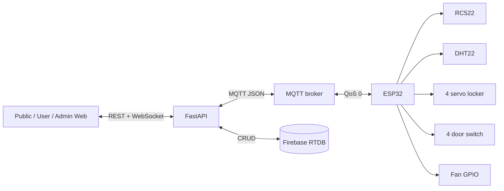

# Tài liệu ôn tập bảo vệ

## Giới thiệu ngắn gọn

GymTag là hệ thống IoT quản lý ra/vào, locker và môi trường phòng gym. FastAPI giữ luật nghiệp vụ và dữ liệu Firebase; MQTT nối backend với thiết bị; WebSocket đẩy thay đổi từ backend đến dashboard; REST phục vụ truy vấn và thao tác người dùng/quản trị.

## Kiến trúc cần nhớ

## Các điểm kỹ thuật nổi bật

- Backend quyết định cấp/trả locker; ESP32 không tự sửa trạng thái sở hữu.
- Một topic locker request dùng field `operation` để phân biệt `scan` và `release`.
- UID RFID được chuẩn hóa uppercase, hai ký tự hex cho mỗi byte.
- Locker được cấp theo số nhỏ nhất trong danh sách `vacant`.
- Servo giữ 90° khi unlock và về 0° sau door CLOSED → OPEN → CLOSED; cooldown RFID 5000 ms, timeout backend 8000 ms và door fail-safe 30000 ms.
- MQTT hiện dùng QoS 0, không retained; reconnect không tự phát lại lệnh cũ.
- Firebase RTDB lưu members, lockers, check logs, environment readings và thresholds.
- Browser không dùng MQTT: REST cho command/query, WebSocket cho server push.
- Wokwi hiện có MFRC522, 4 servo, 4 door button, RELEASE button, DHT22 và fan LED; không dùng relay locker.

## Câu hỏi và trả lời

1. **Vì sao logic cấp locker đặt ở backend?** Vì backend có dữ liệu thành viên và trạng thái toàn bộ locker, nên có thể kiểm tra quyền và tránh để firmware tự quyết định từ dữ liệu cục bộ.
2. **Luồng quét thẻ bắt đầu ở đâu?** `LockerRfid::readCard()` đọc UID; `LockerController::handleCardScan()` publish locker request.
3. **Topic quét locker là gì?** `gymtag/locker/request`; response là `gymtag/locker/response`.
4. **Payload quét tối thiểu gồm gì?** `operation: "scan"` và `card_id` đã chuẩn hóa.
5. **Backend xử lý request ở đâu?** MQTT callback route đến `_handle_locker_request()`, rồi gọi `LockerService.process_locker_scan()` hoặc `release_locker()`.
6. **Member chưa có locker được xử lý thế nào?** Backend tìm locker vacant có số nhỏ nhất, ghi card/timestamp và trả `action: "assign"`.
7. **Quét lại khi đã có locker có cấp locker khác không?** Không; trả `action: "access"` với locker hiện tại và không sửa DB.
8. **Access khác release thế nào?** Access chỉ mở vật lý; release xác minh quyền sở hữu rồi chuyển locker về vacant.
9. **Release cần dữ liệu gì?** `operation: "release"`, `card_id` và `locker_number` nguyên dương.
10. **Nếu card không tồn tại?** Service trả denied; không cấp locker và không servo nào di chuyển.
11. **ESP32 tránh đọc lặp card bằng cách nào?** Cooldown, `PICC_HaltA()` và `PCD_StopCrypto1()`.
12. **Nếu backend không trả lời?** `LockerController` hết timeout 8000 ms và quay về trạng thái an toàn/cooldown theo state machine.
13. **Servo unlock bao lâu?** Không dùng pulse timer; servo giữ 90° đến khi door đã open rồi close.
14. **Vì sao phải chờ CLOSED → OPEN → CLOSED?** Để button đang pressed lúc unlock không làm servo khóa lại ngay.
15. **Nút RELEASE làm gì?** Chỉ đặt `releasePending`; MQTT release được gửi sau khi cửa đóng và servo đã khóa.
16. **Dữ liệu môi trường đi thế nào?** DHT22 → `EnvironmentSensor` → `gymtag/environment/reading` → handler → Firebase → WebSocket/REST → dashboard.
17. **Chu kỳ gửi môi trường là bao lâu?** Khoảng 5 giây theo firmware hiện tại.
18. **Quạt được điều khiển thế nào?** Admin REST khiến backend publish `gymtag/environment/fan_control`; ESP32 nhận và ghi GPIO 12 active-high.
19. **Backend và ESP32 có gọi HTTP trực tiếp nhau không?** Không trong luồng thiết bị hiện tại; chúng trao đổi qua broker MQTT.
20. **QoS MQTT hiện tại là gì và hệ quả?** QoS 0: nhẹ nhưng không đảm bảo giao đúng một lần; application cần chấp nhận timeout/mất message.
21. **Message có retained không?** Không; thiết bị reconnect sẽ không tự nhận lại lệnh cũ.
22. **Client ID ESP32 được tạo thế nào?** Prefix `gymtag_locker_` cộng định danh lấy từ eFuse để giảm trùng client.
23. **Occupancy được tính thế nào?** Lấy log granted mới nhất theo từng card; latest check-in nghĩa là đang ở phòng.
24. **Các trạng thái locker là gì?** `vacant`, `occupied`, `broken`.
25. **Realtime frontend dùng gì?** WebSocket đến endpoint theo audience; mất kết nối thì reconnect với backoff tối đa 10 giây.
26. **Tại sao frontend vẫn gọi REST khi có WebSocket?** WebSocket báo thay đổi, còn REST lấy snapshot đầy đủ và nhất quán.
27. **Admin thay đổi locker có mở khóa vật lý không?** Không; route admin chỉ đổi trạng thái database và không gửi lệnh servo.
28. **Dữ liệu được lưu ở những nhánh Firebase nào?** `members`, `lockers`, `check_logs`, `environment_readings`, và `settings/environment_thresholds`.
29. **Điểm mở rộng khi triển khai 20 locker là gì?** Cần nhiều PWM/door input, nguồn servo riêng và có thể nhiều controller/driver; một ESP32 không nên cấp nguồn trực tiếp cho 20 servo.
30. **Rủi ro concurrency khi hai card cùng xin locker?** Luồng đọc-vacant rồi ghi hiện không thể hiện transaction/lock phân tán; production nên dùng transaction hoặc cơ chế claim nguyên tử.

## Demo đề xuất

1. Mở backend, broker và ba dashboard; chỉ ra trạng thái WebSocket.
2. Quét card mới: quan sát request/response MQTT, Firebase chuyển locker sang occupied và dashboard cập nhật.
3. Quét lại: chứng minh action access không cấp locker thứ hai.
4. Thực hiện release khi đã cấu hình nút/GPIO, hoặc mô phỏng đúng payload MQTT và giải thích giới hạn phần cứng hiện tại.
5. Thay đổi DHT và bật/tắt quạt từ admin; theo dõi vòng dữ liệu hai chiều.

## Giới hạn cần nói thẳng

- Wokwi mô phỏng logic servo/door nhưng không chứng minh dòng nguồn, tải cơ khí và độ bền servo thật.
- QoS 0/non-retained không bảo đảm delivery; chưa có correlation ID rõ ràng cho nhiều request đồng thời.
- Cấp locker cần transaction nếu có nhiều backend worker/request cạnh tranh.
- Broker test công cộng và thông tin cấu hình mặc định không phù hợp production; cần TLS, authentication và ACL topic.
- Thao tác admin locker không đồng bộ một lệnh mở vật lý đến ESP32.

## Đọc tiếp

[Tổng quan hệ thống](00_SYSTEM_OVERVIEW.md) · [Luồng end-to-end](01_END_TO_END_FLOW.md) · [Giao thức MQTT](02_MQTT_PROTOCOL.md) · [Mô hình dữ liệu](03_DATA_MODEL.md) · [State machine locker](modules/locker/STATE_MACHINE.md)
