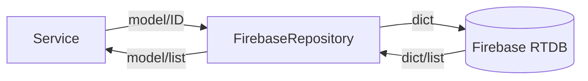

# Luồng Firebase

## Khởi tạo

`FirebaseRepository.initialize()` nạp service account, khởi tạo Firebase Admin với database URL và tạo các locker mặc định còn thiếu từ 1 đến `LOCKER_COUNT`.

## Chuyển đổi dữ liệu

Repository là biên giữa model Pydantic và dictionary Firebase. Enum được lưu bằng `.value`; timestamp là chuỗi ISO; log/reading mới dùng UUID.

## Đường dẫn chính

- `members/{card_id}`
- `lockers/{locker_number}`
- `locker_logs/{uuid}`
- `check_logs/{uuid}`
- `environment_readings/{uuid}`
- `settings/environment_thresholds`

## Async

Firebase Admin SDK là đồng bộ; repository bọc thao tác bằng `asyncio.to_thread()` để không chặn event loop.

## Truy vấn suy diễn

`get_locker_by_card()` duyệt toàn bộ locker. Occupancy lấy tối đa 500 log, giữ log granted mới nhất theo card rồi đếm card có action mới nhất là check-in.

## Giới hạn

Chưa có transaction khi claim locker; nhiều request đồng thời có thể cùng đọc một locker vacant. WebSocket broadcast chỉ xảy ra trong process xử lý thay đổi, không tự lắng nghe thay đổi Firebase từ nguồn ngoài.

Xem [mô hình dữ liệu](../03_DATA_MODEL.md) và [file repository](files/repository.md).
