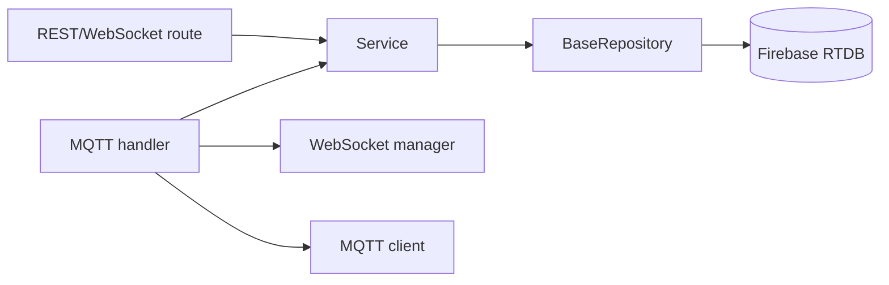

# Tổng quan backend

## Kiến trúc

## Vòng đời

`lifespan()` trong `main.py`:

1. Kiểm tra credential và URL Firebase.
2. Khởi tạo repository và locker mặc định.
3. Tạo service, nạp threshold đã lưu.
4. Gắn dependency vào `app.state`.
5. Tạo MQTT client/handler, đăng ký asyncio loop và kết nối.
6. Khi shutdown, ngắt MQTT.

## Phân chia trách nhiệm

| Lớp | Thực hiện | Không thực hiện |
|---|---|---|
| API route | Validate/auth HTTP, gọi service/repository, trả response | Điều khiển phần cứng |
| MQTT handler | Định tuyến topic/JSON, gọi service, phát MQTT/WS | Chi tiết Firebase SDK |
| Service | Luật nghiệp vụ | MQTT thread, HTTP object |
| Repository | Chuyển đổi và lưu dữ liệu | Chính sách UI/MQTT |
| Model | Schema và enum | I/O |

## Cấu hình và lỗi

Settings đọc từ environment. REST dùng Pydantic và `HTTPException`; MQTT payload sai được log. Lệnh Firebase đồng bộ chạy qua `asyncio.to_thread()`. Startup dừng nếu thiếu credential/URL Firebase.

Xem [luồng MQTT](MQTT_FLOW.md), [luồng API](API_FLOW.md), [Firebase](FIREBASE_FLOW.md) và [tài liệu file](files/main.md).
