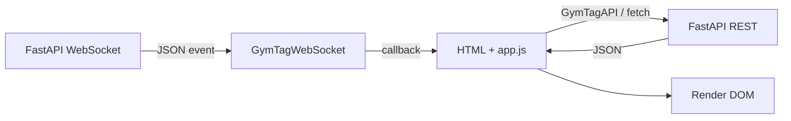

# Luồng dữ liệu frontend

## Giao diện công khai

`initPublicDashboard()` mở WebSocket và `loadInitialData()` gọi public status/lockers. `renderEnvironment()` và `renderLockers()` cập nhật DOM. Sự kiện realtime kích hoạt render hoặc tải lại dữ liệu liên quan.

## Giao diện thành viên

`setupAuth()` lưu token ở `sessionStorage` sau `userLogin()`. `loadUserDashboard()` lấy profile, locker, thống kê và lịch sử; các hàm `renderProfile()`, `renderLocker()`, `renderStats()` và `renderHistory()` hiển thị kết quả. Event realtime chỉ kích hoạt reload khi đã có user token.

## Giao diện quản trị

`setupAuth()` lưu admin token, rồi `initAdmin()` cấu hình tab, WebSocket, modal và control. `loadOverviewData()` lấy các nguồn dữ liệu hiện có. Thống kê locker được tính trong `getLockerStats()`. `renderOverviewLogs()` lọc log theo ngày cục bộ hiện tại, sắp xếp mới nhất trước; `renderOverviewLogsPage()` phân trang theo `OVERVIEW_LOGS_PER_PAGE = 6` và chặn trang hiện tại vượt tổng số trang.

Các thao tác CRUD/điều khiển gọi phương thức tương ứng trong `GymTagAPI`; response REST và event WebSocket cùng có thể dẫn đến refresh UI.
