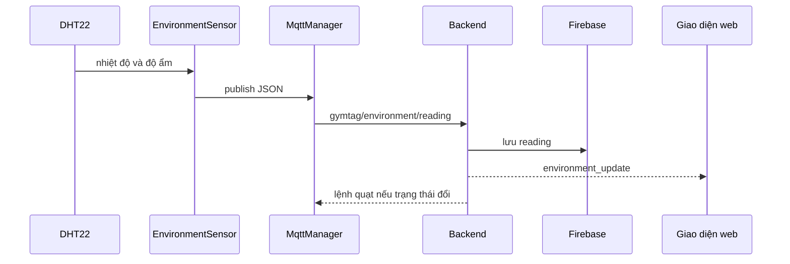

# Luồng module môi trường

## Mục đích và phần cứng

ESP32 đọc DHT22 ở GPIO 15 và gửi telemetry định kỳ. Backend lưu dữ liệu, so sánh ngưỡng và quyết định trạng thái quạt.

## Luồng hoạt động

## Hành vi quan trọng

- Firmware dùng `millis()` để đọc mỗi 5000 ms mà không blocking.
- Payload chứa `temperature`, `humidity` và gửi lên `gymtag/environment/reading`.
- Backend chuyển nhiệt độ/độ ẩm sang float, kiểm tra tính hợp lệ (Sanity check lọc dữ liệu rác/NaN), gán ISO timestamp chuẩn phía server và lưu Firebase.
- **Cơ chế Hysteresis Deadband:** Bật quạt/Cảnh báo khi vượt ngưỡng ($T > T_{\text{threshold}}$ hoặc $H > H_{\text{threshold}}$); Tắt quạt/Phục hồi chỉ khi đã giảm sâu dưới mức trễ ($T \le T_{\text{threshold}} - 1^\circ\text{C}$ và $H \le H_{\text{threshold}} - 3\%$).
- **Ưu tiên lệnh Admin Manual:** Khi Admin điều khiển thủ công (`manual_mode = True`), backend không tự động ghi đè trạng thái quạt của Admin khi có dữ liệu cảm biến mới. Hỗ trợ lệnh `auto` để trả về chế độ tự động.
- **Cảnh báo Telegram:** Gửi thông báo kèm timestamp thời gian thực qua IPv4 transport. Có cơ chế nhắc nhở định kỳ (`ALERT_REMINDER_INTERVAL_MINUTES`) nếu tình trạng vượt ngưỡng kéo dài.
- Backend chỉ publish lệnh quạt khi trạng thái thay đổi, phát `environment_update` qua WebSocket đến tất cả client (Public & Admin).

## Các file

- Firmware: `environment_sensor.h/.cpp`, `hardware_config.h`.
- Backend: `mqtt/handlers.py`, `services/environment_service.py`, repository.
- Frontend: public/admin renderer và WebSocket callback.

## Cách giải thích khi bảo vệ

“EnvironmentSensor chỉ thu thập và publish telemetry thô. Backend giữ ngưỡng và quyết định quạt nên có thể đổi chính sách mà không nạp lại ESP32. Chu kỳ năm giây dùng millis nên callback MQTT vẫn chạy.”
