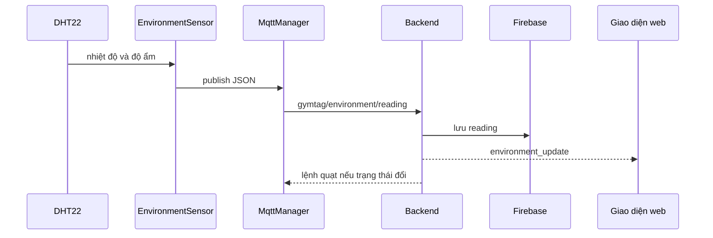

# Luồng module môi trường

## Mục đích và phần cứng

ESP32 đọc DHT22 ở GPIO 15 và gửi telemetry định kỳ. Backend lưu dữ liệu, so sánh ngưỡng và quyết định trạng thái quạt.

## Luồng hoạt động

## Hành vi quan trọng

- Firmware dùng `millis()` để đọc mỗi 5000 ms mà không blocking.
- Payload chứa `temperature`, `humidity` và trạng thái `fan_on` cục bộ.
- Backend chuyển nhiệt độ/độ ẩm sang float, lưu timestamp phía server và gửi cảnh báo Telegram khi cần.
- Backend chỉ publish lệnh quạt khi trạng thái thay đổi, không gửi ở mọi reading.

## Lỗi và giới hạn

Firmware hiện không loại bỏ NaN một cách tường minh trước khi publish. Backend chuyển kiểu float rồi service lưu dữ liệu; khi chạy phần cứng/mô phỏng cần kiểm tra tình huống cảm biến lỗi.

## Các file

- Firmware: `environment_sensor.h/.cpp`, `hardware_config.h`.
- Backend: `mqtt/handlers.py`, `services/environment_service.py`, repository.
- Frontend: public/admin renderer và WebSocket callback.

## Cách giải thích khi bảo vệ

“EnvironmentSensor chỉ thu thập và publish telemetry thô. Backend giữ ngưỡng và quyết định quạt nên có thể đổi chính sách mà không nạp lại ESP32. Chu kỳ năm giây dùng millis nên callback MQTT vẫn chạy.”
