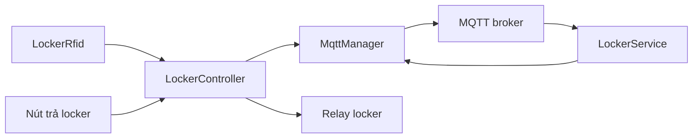

# Luồng module locker

## Mục đích

Đọc UID RFID, yêu cầu backend cấp/truy cập/trả locker, kiểm tra phản hồi và điều khiển relay theo state machine không blocking.

## Phần cứng liên quan

- RC522: SS GPIO 21, RST GPIO 4, giao tiếp SPI.
- Relay locker: có logic nhưng mapping đang bị tắt với `LOCKER_RELAY_COUNT=0`.
- Nút trả locker: có logic nhưng đang tắt với `RELEASE_BUTTON_PIN=-1`.

## Khởi tạo

`main.setup()` gọi `LockerRfid::begin()` rồi `LockerController::begin()`. RFID khởi tạo SPI/RC522. Controller đưa các relay đã map về inactive và cấu hình nút `INPUT_PULLUP`; hiện hai vòng không kích phần cứng vì mapping bị tắt.

## Vòng lặp bình thường

```text
loop()
→ MqttManager::update()
→ EnvironmentSensor::update()
→ LockerRfid::readCard(cardId)
→ LockerController::handleCardScan(cardId)
→ LockerController::update()
```

`MqttManager::update()` chạy trước để callback phản hồi có thể gọi `LockerController::handleMqttPayload()`.

## Dữ liệu vào

- UID từ RC522, chuẩn hóa uppercase với hai ký tự hex mỗi byte.
- Byte phản hồi MQTT của locker.
- Nút nhấn active-low nếu GPIO được cấu hình.
- Thời gian `millis()` cho debounce, timeout và cooldown.

## Dữ liệu ra

- MQTT request đến `gymtag/locker/request`.
- Pulse relay active trong 1000 ms nếu locker được map.
- Log Serial mô tả state và lỗi.

## Tương tác module



Controller không truy cập Wi-Fi, Firebase hoặc member database trực tiếp.

## Luồng đầy đủ

1. RFID đọc card hợp lệ khi controller đang `IDLE`.
2. Controller publish `operation="scan"` và chuyển sang `WAITING_SCAN`.
3. Backend trả `assign`, `access` hoặc `denied`.
4. `assign/access` mở locker rồi vào `MEMBER_SESSION`; `denied` vào cooldown.
5. Trong member session, nút release publish `operation="release"` kèm số locker.
6. Release thành công kết thúc phiên; bị từ chối thì quay lại phiên member.

## Các trường hợp lỗi

- MQTT chưa kết nối: publish thất bại và controller vào trạng thái an toàn.
- Không có phản hồi trong 8 giây: scan vào cooldown; release quay lại member session.
- JSON/card/action/số locker không hợp lệ: không kích relay.
- Locker không có trong mapping: chỉ log, không ghi GPIO.
- Phiên quá 30 giây: tự vào cooldown mà không tự release database.

## Hằng số quan trọng

| Hằng số                     | Giá trị | Ý nghĩa                                     |
| --------------------------- | ------: | ------------------------------------------- |
| `RELAY_PULSE_MS`            |    1000 | Thời gian kích relay                        |
| `BUTTON_DEBOUNCE_MS`        |      50 | Debounce nút                                |
| `RFID_COOLDOWN_MS`          |    5000 | Khoảng cách tối thiểu giữa hai lần đọc RFID |
| `BACKEND_TIMEOUT_MS`        |    8000 | Timeout phản hồi MQTT                       |
| `MEMBER_SESSION_TIMEOUT_MS` |   30000 | Thời lượng tối đa của phiên                 |

## Câu hỏi bảo vệ

- Vì sao không dùng `delay()`? Vì nó sẽ chặn MQTT keepalive, đọc cảm biến và state machine.
- Vì sao dùng `lockerNumber - 1`? Số locker backend bắt đầu từ 1, index mảng C++ bắt đầu từ 0; code kiểm tra biên trước.
- Vì sao relay chưa mở? Repository chưa có mapping GPIO đã xác nhận, nên số lượng an toàn được đặt bằng 0.

Xem [state machine](STATE_MACHINE.md), [các file](FILES.md) và [kịch bản trả locker](../../scenarios/RELEASE_LOCKER.md).
