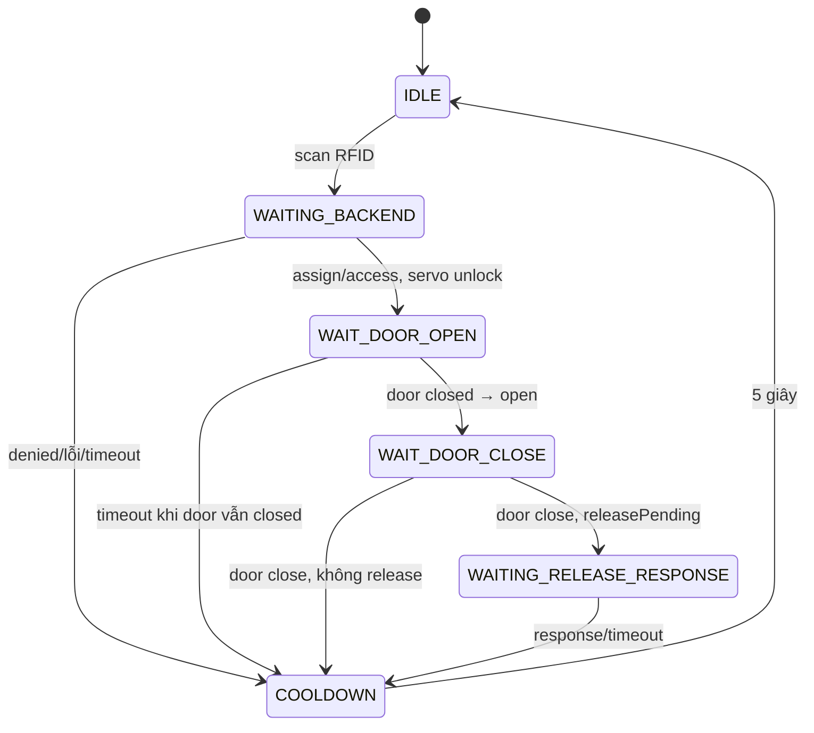

# State machine độc lập cho từng locker dùng servo

## `IDLE`

Cho phép scan mới. RELEASE bị ignore.

## `WAITING_BACKEND`

Chờ assign/access. Response hợp lệ phải có locker #1–#3; servo GPIO tương ứng chuyển 90°.

## `WAIT_DOOR_OPEN`

Đọc door GPIO của locker hiện tại, ghi nhận door closed ban đầu rồi bắt buộc chờ released/HIGH. Điều này ngăn servo khóa ngay khi button vẫn pressed lúc vừa unlock.

## `WAIT_DOOR_CLOSE`

Chờ pressed/LOW. Khi closed, servo chuyển 0°. Nếu không release pending thì kết thúc physical session ngay; nếu có thì mới publish release.

## `WAITING_RELEASE_RESPONSE`

Servo đã locked. Response `release` chỉ xác nhận backend/Firebase đã chuyển locker vacant; không unlock lại.

## `COOLDOWN`

Chặn scan 5 giây rồi về `IDLE`.

Door timeout 30 giây chỉ là fail-safe. Door đang open không bị force-lock.

## Đồng thời nhiều locker

State machine ở trên tồn tại cho từng phần tử `lockers[3]`, không còn một state global. Do đó Locker #1 có thể ở `WAIT_DOOR_CLOSE` trong khi Locker #2 ở `WAIT_DOOR_OPEN`. Door #n chỉ được dùng để update session Locker #n.

RFID vẫn là một trụ vật lý nên chỉ giữ một scan request đang chờ response cùng lúc. Khi response đến và tạo session locker, RFID nhận card khác để tạo session tiếp theo. RELEASE là button chung, áp dụng vào locker assign/access gần nhất; quét lại card để chọn lại locker cần release khi có nhiều session.
