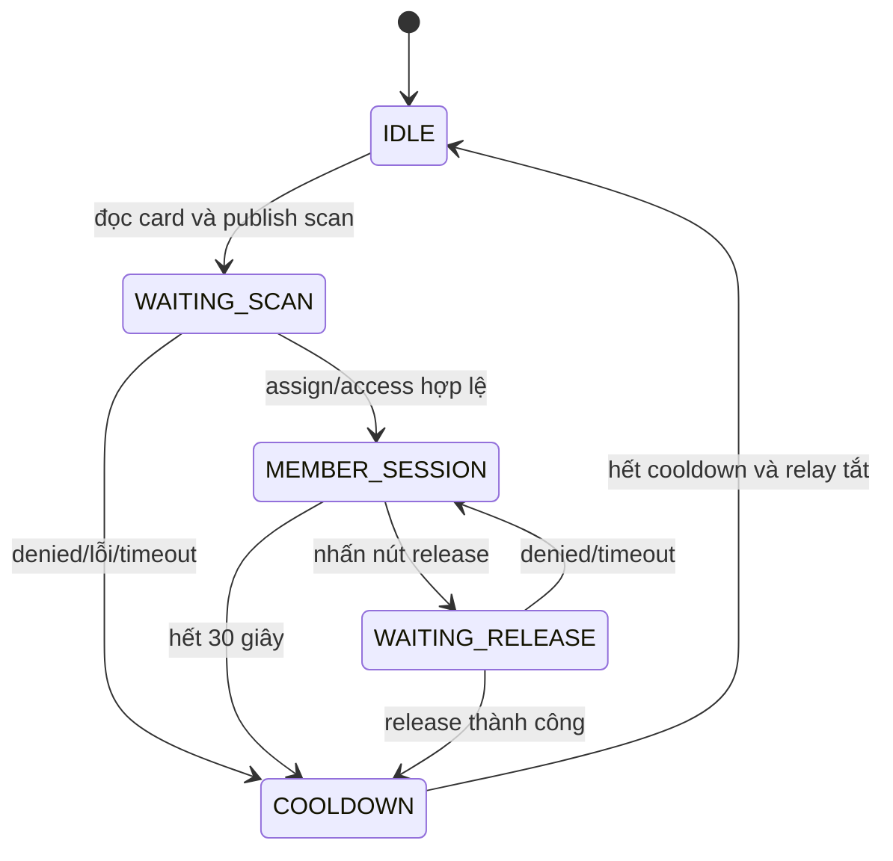

# State machine locker trên ESP32

Nguồn: `enum class State` trong `esp32/src/locker_controller.cpp`.

## `IDLE`

Cho phép lần quét card mới. `handleCardScan()` bỏ qua card ở mọi state khác để không ghi đè phiên đang chạy.

## `WAITING_SCAN`

Chờ response cho operation scan. Chỉ `assign` hoặc `access` với card/số locker hợp lệ mới mở relay và vào phiên member. `denied`, payload sai hoặc timeout dẫn đến cooldown.

## `MEMBER_SESSION`

Giữ card, member và locker hiện tại. Controller theo dõi nút release và timeout 30 giây. Hết phiên chỉ xóa state cục bộ, không tự trả locker trong Firebase.

## `WAITING_RELEASE`

Chờ backend xác nhận quyền sở hữu. `release` thành công kết thúc phiên; `denied` hoặc timeout quay lại member session để tránh mất ngữ cảnh.

## `COOLDOWN`

Chặn quét mới đến khi đủ thời gian cooldown và relay đã tắt, sau đó xóa dữ liệu phiên và về `IDLE`.

## Cooldown RFID riêng

`LockerRfid::readCard()` cũng áp dụng 5000 ms từ UID được chấp nhận gần nhất. State machine bảo vệ phiên nghiệp vụ; cooldown reader ngăn RC522 đọc lặp quá nhanh.

## Chống response cũ

Controller đối chiếu `card_id` trong response với card hiện tại và kiểm tra action phù hợp state. Response đến trễ hoặc thuộc card khác bị bỏ qua mà không kích GPIO.
