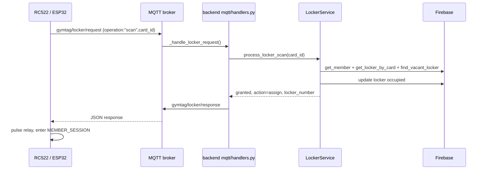

# Kịch bản: tự động cấp locker

Điều kiện: card thuộc member hợp lệ, chưa giữ locker và còn locker `vacant`. Locker được chọn theo số nhỏ nhất. ESP32 chỉ kích relay khi response được cấp quyền và có số locker điều khiển được.
