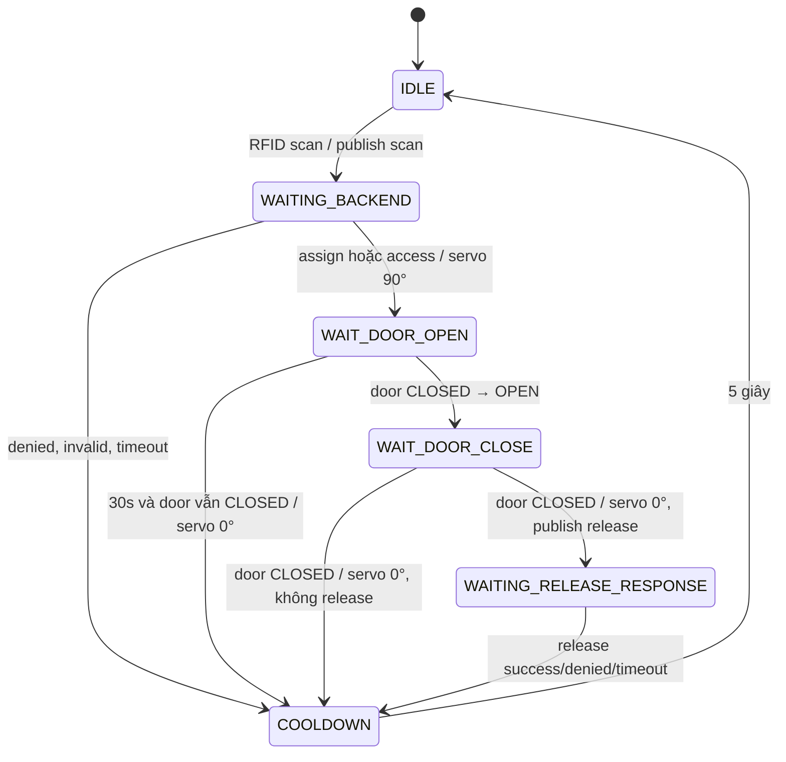

# Kế hoạch và implementation mô phỏng Wokwi GymTag

## 1. Trạng thái implementation

Mạch Wokwi đã được chuyển sang kiến trúc 4 locker dùng servo và door button. Relay, locker LED, solenoid, display và buzzer không còn thuộc mạch mô phỏng.

Backend vẫn giữ protocol đơn giản:

```text
scan → assign hoặc access
release → validate ownership → vacant
```

ESP32 chịu trách nhiệm toàn bộ physical flow: servo, door switch, debounce và chỉ gửi release sau khi cửa đã đóng/khóa.

## 2. Board và dependency

- PlatformIO environment: `[env:esp32]`.
- Board build: `esp32dev`.
- Board Wokwi: `board-esp32-devkit-c-v4`.
- Framework: Arduino.
- Servo library: `madhephaestus/ESP32Servo` (build đã resolve phiên bản 3.2.1).
- Các library khác: DHTesp, PubSubClient, ArduinoJson, MFRC522.
- `wokwi.toml` tiếp tục trỏ đến `.pio/build/esp32/firmware.bin` và `.elf`; không cần sửa.

## 3. Hardware cuối cùng

| Component | Số lượng | Mục đích | Wokwi part |
|---|---:|---|---|
| ESP32 DevKitC V4 | 1 | Controller, Wi‑Fi, SPI, PWM, GPIO | `board-esp32-devkit-c-v4` |
| MFRC522 | 1 | Đọc UID locker | `board-mfrc522` |
| DHT22 | 1 | Nhiệt độ/độ ẩm | `wokwi-dht22` |
| Fan LED + resistor | 1 bộ | Đại diện quạt digital on/off | `wokwi-led`, `wokwi-resistor` |
| Servo locker | 4 | 0° locked, 90° unlocked | `wokwi-servo` |
| Door button | 4 | Pressed=closed, released=open | `wokwi-pushbutton` |
| RELEASE button | 1 | Đánh dấu yêu cầu trả locker | `wokwi-pushbutton` |

Không mô phỏng LCD, OLED, buzzer, relay, solenoid hay door sensor khác vì firmware không cần chúng.

## 4. GPIO cuối cùng

| GPIO | Component | Signal | Mode | Ghi chú |
|---:|---|---|---|---|
| 4 | MFRC522 | RST | Output | Strapping pin hiện hữu từ trước |
| 12 | Fan LED | FAN | Output | Active-high; strapping pin hiện hữu |
| 13 | Door #1 button | CLOSED | `INPUT_PULLUP` | LOW=closed |
| 14 | Door #2 button | CLOSED | `INPUT_PULLUP` | LOW=closed |
| 15 | DHT22 | DATA | Digital | Strapping pin hiện hữu |
| 16 | Door #3 button | CLOSED | `INPUT_PULLUP` | LOW=closed |
| 17 | Door #4 button | CLOSED | `INPUT_PULLUP` | LOW=closed |
| 18 | MFRC522 | SCK | SPI output | `SPI.begin()` mặc định |
| 19 | MFRC522 | MISO | SPI input | `SPI.begin()` mặc định |
| 21 | MFRC522 | SDA/SS | SPI chip select | Không phải I2C SDA |
| 23 | MFRC522 | MOSI | SPI output | `SPI.begin()` mặc định |
| 25 | Servo #1 | PWM | Output | ESP32Servo |
| 26 | Servo #2 | PWM | Output | ESP32Servo |
| 27 | Servo #3 | PWM | Output | ESP32Servo |
| 32 | Servo #4 | PWM | Output | ESP32Servo |
| 33 | RELEASE button | RELEASE | `INPUT_PULLUP` | LOW=pressed |

Không có GPIO conflict. Các chân mới 13, 14, 16, 17, 25, 26, 27, 32, 33 không phải input-only hay strapping pins và không đụng SPI/UART/DHT/fan.

## 5. Wiring table

| Component pin | Nối ESP32 | Ý nghĩa |
|---|---|---|
| MFRC522 3.3V/GND | 3V3/GND | Reader dùng logic 3.3 V |
| MFRC522 SCK/MISO/MOSI | 18/19/23 | SPI mặc định |
| MFRC522 SDA/RST | 21/4 | CS và reset |
| MFRC522 IRQ | Không nối | Firmware không dùng interrupt |
| DHT22 VCC/GND/DATA | 3V3/GND/15 | Reading mỗi 5 giây |
| Fan LED anode | GPIO12 qua 1 kΩ | HIGH=fan on |
| Fan LED cathode | GND | Common ground |
| Servo #1 PWM/V+/GND | 25/5V/GND | Locker #1 |
| Servo #2 PWM/V+/GND | 26/5V/GND | Locker #2 |
| Servo #3 PWM/V+/GND | 27/5V/GND | Locker #3 |
| Servo #4 PWM/V+/GND | 32/5V/GND | Locker #4 |
| Door #1 contacts | GPIO13/GND | Pressed LOW=closed |
| Door #2 contacts | GPIO14/GND | Pressed LOW=closed |
| Door #3 contacts | GPIO16/GND | Pressed LOW=closed |
| Door #4 contacts | GPIO17/GND | Pressed LOW=closed |
| RELEASE contacts | GPIO33/GND | Pressed LOW=request release |

Trong Wokwi, servo có thể lấy 5V từ board. Mạch thật cần nguồn servo riêng đủ dòng và common GND; không cấp nhiều servo thực từ regulator nhỏ của board.

## 6. State machine locker cuối cùng



Các state thực tế trong `locker_controller.cpp`:

```text
IDLE
WAITING_BACKEND
WAIT_DOOR_OPEN
WAIT_DOOR_CLOSE
WAITING_RELEASE_RESPONSE
COOLDOWN
```

## 7. Servo behavior

Các góc được tập trung trong `hardware_config.h`:

```cpp
SERVO_LOCKED_ANGLE = 0;
SERVO_UNLOCKED_ANGLE = 90;
```

Khi `assign/access` hợp lệ, servo chuyển đến 90° và giữ nguyên; không còn timer pulse một giây. Servo chỉ trở về 0° khi firmware đã quan sát đúng chuỗi door CLOSED → OPEN → CLOSED.

Release response chỉ xác nhận backend đã xóa ownership. Nó không di chuyển servo lần nữa, vì servo đã khóa trước lúc publish release.

## 8. Door switch behavior

Mỗi button dùng `INPUT_PULLUP`:

```text
button PRESSED  → GPIO LOW  → door CLOSED
button RELEASED → GPIO HIGH → door OPEN
```

Debounce 50 ms dùng `millis()`, không dùng `delay()`. Firmware cập nhật cả bốn input nhưng chỉ door button có index trùng locker session hiện tại mới ảnh hưởng state; Door #2 không thể đóng/mở session Locker #1.

Điểm quan trọng: khi vừa unlock, firmware không khóa ngay dù button đang pressed. Nó ghi nhận trạng thái closed, chờ button released để sang `WAIT_DOOR_CLOSE`, rồi chỉ khóa sau lần pressed tiếp theo.

Wokwi pushbutton là momentary. Trước khi scan, Ctrl-click door button tương ứng để giữ trạng thái pressed/closed; release button đó để mở cửa, rồi press/Ctrl-click lại để đóng. Keyboard shortcut Door #1–#4 là `1`–`4`; RELEASE là `R`.

## 9. Release flow

RELEASE chỉ có hiệu lực trong `WAIT_DOOR_OPEN` hoặc `WAIT_DOOR_CLOSE`. Nhấn ở `IDLE` bị ignore.

```text
scan card đang giữ locker
→ backend action=access
→ servo UNLOCKED
→ press RELEASE: releasePending=true
→ door CLOSED → OPEN → CLOSED
→ servo LOCKED
→ publish cùng gymtag/locker/request:
   {card_id, operation:"release", locker_number}
→ backend validate ownership và ghi vacant
→ response action=release
→ ESP32 clear session, không mở servo lần nữa
```

RELEASE có thể được nhấn trước hoặc sau khi door mở, miễn trước khi door đóng kết thúc session. Nếu không nhấn RELEASE, door close vẫn khóa servo nhưng không publish release; locker tiếp tục occupied.

## 10. Timeout và cooldown

- Backend response timeout: 8 giây.
- Door action fail-safe: 30 giây.
- RFID/state cooldown: 5 giây.

Nếu servo đã unlock nhưng người dùng không mở cửa và door vẫn closed sau 30 giây, firmware khóa servo, clear session và vào cooldown. Nếu door đang open mà chưa đóng, firmware log một lần và tiếp tục chờ; không ép servo khóa vào cửa đang mở.

Normal flow không chờ đủ 30 giây: session kết thúc ngay khi cửa đã mở rồi đóng, hoặc sau release response nếu `releasePending=true`.

## 11. Backend locker count cho demo

Backend đọc `LOCKER_COUNT` bằng Pydantic Settings. Môi trường hiện tại có 20 locker và initializer chỉ thêm record thiếu, không xóa #5–#20.

Để mọi response có hardware mapping, môi trường demo nên dùng:

```text
LOCKER_COUNT=4
Firebase RTDB/demo dataset riêng chỉ có lockers/1..4
```

Không đổi hard-code production và không tự xóa database 20 locker hiện có. Chỉ đặt `LOCKER_COUNT=4` trên database đã có 20 record là chưa đủ.

## 12. MQTT/network

ESP32 dùng `Wokwi-GUEST`, broker `broker.hivemq.com:1883`, client ID từ eFuse. Topics không đổi:

| Hướng | Topic |
|---|---|
| ESP32 → backend | `gymtag/locker/request` |
| Backend → ESP32 | `gymtag/locker/response` |
| ESP32 → backend | `gymtag/environment/reading` |
| Backend → ESP32 | `gymtag/environment/fan_control` |

Protocol release hiện tại được giữ nguyên; backend không biết servo angle hay door state.

## 13. Layout Wokwi

```text
┌──────────── USER INPUT ────────────┐
│ MFRC522          RELEASE BUTTON   │
└───────────────────────────────────┘

                 ┌─────────────┐
                 │    ESP32    │
                 └─────────────┘

┌──── ENVIRONMENT ────┐    ┌──────── LOCKERS ────────┐
│ DHT22               │    │ Servo #1 + Door #1      │
│ FAN LED             │    │ Servo #2 + Door #2      │
└─────────────────────┘    │ Servo #3 + Door #3      │
                           │ Servo #4 + Door #4      │
                           └─────────────────────────┘
```

`diagram.json` dùng direct connection, không breadboard. RFID nằm trái/trên, input bên trái, ESP32 giữa, bốn cặp servo/door xếp dọc bên phải. Power đỏ, ground đen, SPI dùng màu riêng, servo PWM xanh và door signal cyan.

## 14. Scenario kiểm thử

### Assign

Card mới → backend cấp #1 → Servo #1 90° → release Door #1 → press Door #1 → Servo #1 0° → Firebase vẫn occupied.

### Access

Card đang giữ #1 → response access → Servo #1 90° → door open/close → Servo #1 0° → ownership không đổi.

### Release

Access #1 → press RELEASE → `releasePending=true` → door open/close → Servo #1 0° → ESP32 publish release → backend ghi vacant → response chỉ kết thúc session.

### Do not release

Access → door open/close → servo lock → không có release MQTT → locker vẫn occupied.

### Wrong door

Trong session #1, thay đổi Door #2 không làm đổi state hoặc Servo #1.

### Release outside session

Nhấn RELEASE ở `IDLE` chỉ log ignore.

### Unknown card

Backend denied → không servo nào di chuyển.

## 15. Logging chuyển trạng thái

Firmware chỉ log event, không spam mỗi loop. Các log chính:

```text
RFID accepted: 01020304
<member> - Locker #1 (assign/access).
Locker #1 unlocked.
Waiting for Door #1 to open.
Door #1 opened. Waiting for it to close.
Door #1 closed.
Locker #1 locked.
Release marked pending...
Publishing release request...
Locker #1 released successfully...
```

## 16. Kết quả build/test

- PlatformIO `pio run`: PASS.
- ESP32Servo resolved: 3.2.1.
- Firmware RAM: 45.620/327.680 bytes (13,9%).
- Firmware flash: 789.689/1.310.720 bytes (60,2%).
- Backend pytest: 13 passed; có warning sẵn về Starlette/httpx và JWT key length.
- Không có backend business-code change.

## 17. Giới hạn còn lại

- Pushbutton Wokwi không khởi tạo ở trạng thái held; người demo phải Ctrl-click door button thành closed trước scan hoặc dùng automation scenario sau này.
- Broker MQTT public/QoS 0 không bảo đảm delivery và không phù hợp production.
- Door open có thể giữ session vô hạn theo lựa chọn fail-safe an toàn; firmware không ép servo khóa khi cửa mở.
- Bốn servo Wokwi không chứng minh nguồn/dòng/nhiễu của servo thật.
- Backend demo cần Firebase dataset riêng bốn locker; repository không tự xóa record #5–#20.
- Chưa có retry/idempotency riêng nếu release được backend xử lý nhưng response MQTT bị mất.

## 18. Trạng thái cuối

```text
IMPLEMENTATION STATUS: COMPLETE
```
