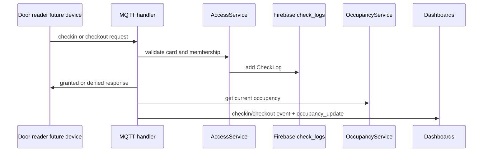

# Gym Entry, Exit & Occupancy

## Mục đích

Module xác minh check-in/check-out, ghi lịch sử buổi tập và tính số người hiện có trong gym.

## Thành phần và file

| Layer | Source chính | Vai trò |
|---|---|---|
| ESP32 / Hardware | N/A trong firmware hiện tại | Chưa có firmware door reader riêng |
| MQTT | backend/app/mqtt/topics.py, handlers.py | Contract door request/response |
| Backend | services/access_service.py, occupancy_service.py, api/routes_logs.py | Validate access và occupancy |
| Firebase | models/check_log.py, repositories/firebase_repo.py | Node check_logs |
| Frontend | public/app.js, user/app.js, admin/app.js | Occupancy, logs, user stats |

## MQTT contract đã có

| Hướng | Topic | Payload chính |
|---|---|---|
| Door ESP32 → backend | gymtag/door/checkin_request | {"card_id":"..."} |
| Door ESP32 → backend | gymtag/door/checkout_request | {"card_id":"..."} |
| Backend → device | gymtag/door/checkin_response | action, status, member_name, reason |
| Backend → device | gymtag/door/checkout_response | action, status, duration_minutes, reason |

Lưu ý quan trọng: topics và backend handler đã tồn tại, nhưng esp32/src hiện chỉ có RC522 cho locker; không có firmware check-in/check-out door controller. Đây là integration point còn thiếu, không phải feature firmware đang chạy.

## Business flow

checkin() từ chối card không tồn tại, account inactive, membership expired hoặc card đã check-in. checkout() yêu cầu có check-in active, tính duration từ timestamp và ghi log checkout.

## Firebase, REST và frontend

Firebase check_logs lưu card_id, member_name, action, status, reason, timestamp và duration_minutes. OccupancyService gọi repository để tính latest granted event theo card.

- Public: GET /api/public/status trả current_occupancy.
- Admin: GET /api/admin/activity hiển thị toàn bộ logs.
- User: GET /api/user/me/history và /me/stats hiển thị lịch sử, tổng buổi và thời lượng.
- WebSocket: admin nhận checkin_event hoặc checkout_event; public nhận occupancy_update.

## Failure cases

- Invalid JSON hoặc thiếu card_id: MQTT handler log và bỏ request.
- Unknown/inactive/expired: ghi denied CheckLog để audit.
- Check-in lặp không thay occupancy.
- Checkout khi chưa check-in bị denied.

## Câu hỏi vấn đáp

1. Occupancy được tính từ log như thế nào?
2. Vì sao denied attempt cũng cần được lưu?
3. Check-in và check-out dùng topic riêng vì sao?
4. Firmware door reader hiện đã tồn tại chưa?
5. duration_minutes được tính ở layer nào?
6. Tại sao public chỉ nhận occupancy_update, còn admin nhận activity detail?
