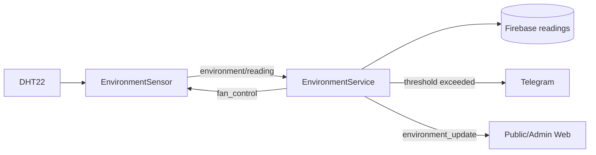

# Environment Monitoring, Fan Automation & Alerts

## Mục đích

Module lấy telemetry nhiệt độ/độ ẩm, lưu history, bật/tắt fan theo threshold hoặc lệnh admin, và gửi Telegram alert khi môi trường vượt ngưỡng.

## Thành phần và file

| Layer | Source chính | Vai trò |
|---|---|---|
| ESP32 | environment_sensor.cpp, fan_controller.cpp, hardware_config.h, main.cpp | DHT22 GPIO15; fan GPIO12 |
| MQTT | mqtt_manager.cpp; backend mqtt/topics.py, handlers.py | Telemetry và fan command |
| Backend | services/environment_service.py, notification_service.py, routes_environment.py, routes_admin.py | Auto/manual mode, hysteresis, alert |
| Firebase | models/environment.py, firebase_repo.py | environment_readings, settings/environment_thresholds |
| Frontend | public/app.js, admin/app.js | telemetry, history, control/threshold |

Không có MQ135 hay air-quality sensor trong firmware hiện tại; module chỉ xử lý temperature và humidity.

## Firmware, topic và payload

EnvironmentSensor::update() chạy mỗi 5000 ms, đọc DHT22 và publish:

```json
{"temperature":29.4,"humidity":71.2}
```

| Hướng | Topic | Ý nghĩa |
|---|---|---|
| ESP32 → backend | gymtag/environment/reading | DHT telemetry |
| Backend → ESP32 | gymtag/environment/fan_control | {"fan":"on|off","reason":"..."} |

FanController chỉ chấp nhận on/off và ghi GPIO12 active-high.

## Main flow



EnvironmentService kiểm tra outlier, sau đó áp dụng manual mode ưu tiên cao nhất hoặc auto mode. Auto mode bật fan nếu temp hoặc humidity vượt threshold; chỉ tắt khi cả hai thấp hơn threshold trừ hysteresis để tránh bật/tắt liên tục.

## REST, WebSocket và failure cases

- GET /api/environment/latest và /history cung cấp reading.
- Admin có history, POST fan on/off/auto, GET/PUT thresholds, POST Telegram test.
- Threshold lưu ở settings/environment_thresholds, readings lưu environment_readings.
- WebSocket environment_update đến public và admin; threshold_update chỉ đến admin.

Failure: payload thiếu/non-numeric bị handler bỏ; reading ngoài -20..80°C hoặc 0..100% bị service từ chối; MQTT fan command invalid bị firmware log; Telegram thiếu credential hoặc bị rate-limit không làm hỏng telemetry persistence.

## Câu hỏi vấn đáp

1. Vì sao dùng hysteresis cho quạt?
2. Manual mode có ưu tiên hơn auto vì sao?
3. Reading được lưu trước hay sau quyết định fan?
4. Tại sao ESP32 không tự quyết định threshold?
5. MQTT fan payload gồm gì?
6. MQ135 có đang tồn tại trong code không?
7. Vì sao Telegram lỗi không được làm dừng luồng telemetry?
