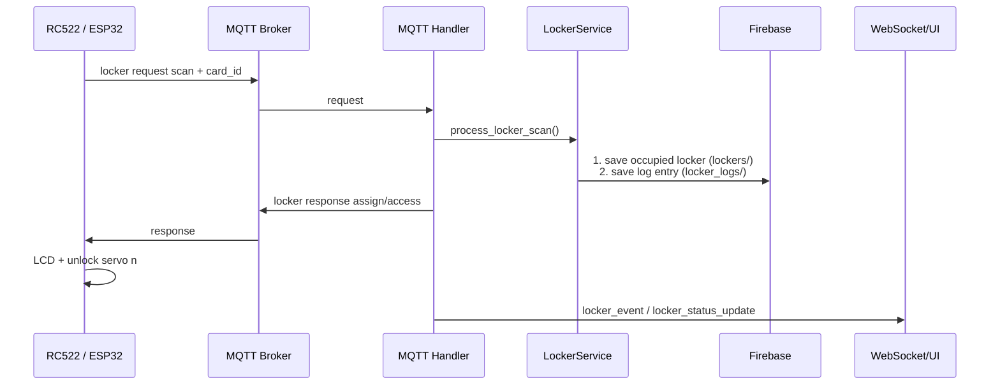

# Locker Access & Physical Locker

## Mục đích

Module cấp locker trống cho RFID hợp lệ, mở lại locker thành viên đang giữ, và chỉ trả locker sau khi cửa đã đóng/servo đã khóa. Backend quyết định ownership; ESP32 thực thi an toàn vật lý.

## Thành phần và file

| Layer | Source chính | Vai trò |
|---|---|---|
| ESP32 | lockerRFID.cpp, locker_controller.cpp, display_controller.cpp, hardware_config.h, main.cpp | RFID, LCD, servo, door switch, release |
| MQTT | esp32/src/mqtt_manager.cpp; backend/app/mqtt/topics.py, handlers.py | Request/response JSON |
| Backend | services/locker_service.py, api/routes_lockers.py, api/routes_admin.py | Assign/access/release và admin override |
| Firebase | models/locker.py, repositories/firebase_repo.py | Lưu lockers/{number} |
| Web | public/app.js, user/app.js, admin/app.js, shared API/WS | Hiển thị public/user/admin |

## Hardware và firmware

- RC522 dùng SPI: SCK 18, MISO 19, MOSI 23, CS 21, RST 4.
- LCD1602 I2C: SDA 22, SCL 25, address 0x27.
- Locker 1–3: servo GPIO 26/27/32; door switch GPIO 13/14/16.
- Release button chung: GPIO 33, INPUT_PULLUP; nhấn là LOW.
- Servo 0° là locked, 90° là unlocked.

setup() trong main.cpp khởi tạo RFID, LCD, controller locker và MQTT. loop() đọc RFID, gọi LockerController::update() cho mọi session locker và xử lý MQTT liên tục.

LockerController giữ LockerSession lockers[3]; vì vậy Door #1 chỉ ảnh hưởng Locker #1. Một RFID station chỉ giữ một PendingScan chờ response ngắn hạn, nhưng Locker #1 và #2 có thể cùng ở trạng thái cửa mở.

## MQTT

| Hướng | Topic | Payload |
|---|---|---|
| ESP32 → backend | gymtag/locker/request | {"card_id":"...","operation":"scan"} |
| ESP32 → backend | gymtag/locker/request | {"card_id":"...","operation":"release","locker_number":1} |
| Backend → ESP32 | gymtag/locker/response | {"card_id":"...","action":"assign|access|release|denied","locker_number":1,"member_name":"...","reason":"..."} |

MQTTMessageHandler._handle_locker_request() route theo operation. LockerService.process_locker_scan() tìm locker đã sở hữu hoặc locker vacant nhỏ nhất; release_locker() xác minh card là owner trước khi chuyển locker về vacant.

## Firebase, REST và realtime

Firebase `lockers/{locker_number}` lưu `status`, `is_occupied`, `card_id`, `assigned_at`. Node `locker_logs/{uuid}` lưu toàn bộ lịch sử thao tác mượn/trả/mở tủ/admin can thiệp/từ chối. LockerService ghi ownership và nhật ký vào Firebase; firmware không ghi database trực tiếp.

- Public REST: `/api/public/lockers`, không trả card_id.
- User REST: `/api/user/me/locker`.
- Admin REST: `/api/admin/lockers` (danh sách chi tiết), `/api/admin/lockers/logs` (lịch sử hoạt động lọc theo số tủ/mã thẻ), force assign/release và status vacant/occupied/broken.
- WebSocket: admin nhận `locker_event` có danh sách tủ và log gần nhất; public nhận `locker_status_update` không có Card ID.

## Sequence

## State machine và failure cases

Mỗi locker có IDLE → WAIT_DOOR_OPEN → WAIT_DOOR_CLOSE → IDLE, hoặc WAITING_RELEASE_RESPONSE sau release request. Door timeout là 30 giây; backend response timeout là 8 giây. Cửa đang mở quá lâu chỉ log warning, không ép servo khóa vào cửa.

- Card không tồn tại, không có locker trống, response invalid: denied, servo không mở.
- MQTT không phản hồi: pending scan hết 8 giây.
- Door chưa mở: servo lock lại sau timeout khi switch vẫn closed.
- Release sai owner: backend denied; locker vật lý đã lock nhưng Firebase ownership giữ nguyên.
- Admin force operations chỉ đổi Firebase/status; không phải lệnh mở servo vật lý.

## Câu hỏi vấn đáp

1. Vì sao backend thay vì ESP32 quyết định locker nào được cấp?
2. assign khác access ở chỗ nào?
3. Vì sao release chỉ publish sau door open/close và servo lock?
4. Vì sao public WebSocket không gửi card_id?
5. Làm sao firmware cho phép Locker #1 và #2 cùng mở?
6. Door switch LOW/HIGH được quy ước như thế nào?
7. Khi MQTT response mất thì physical và Firebase state có rủi ro gì?
