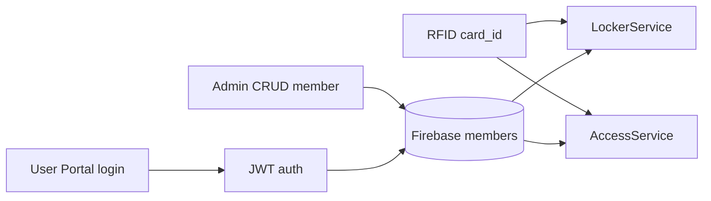

# Member Identity, Membership & User Accounts

## Mục đích

Module quản lý identity dựa trên Card ID, membership, trạng thái active, password và quyền truy cập admin/user. Đây là nguồn dữ liệu quyền cho Locker và Access Attendance.

## Thành phần và file

| Layer | Source chính | Vai trò |
|---|---|---|
| ESP32 | lockerRFID.cpp | Chuẩn hóa UID RFID uppercase không dấu : |
| Backend | api/auth.py, routes_members.py, routes_user.py, routes_admin.py | CRUD, JWT, password |
| Firebase | models/member.py, firebase_repo.py | members/{card_id} |
| Frontend | user/app.js, admin/app.js, shared/api.js | Login/profile/password và CRUD admin |

## Dữ liệu và API

Member gồm card_id, name, email, phone, membership_expiry, is_active, created_at và password_hash. FirebaseRepository preserve password hash khi member được cập nhật không có password mới.

- User: POST /api/user/login; GET /me/profile, /me/history, /me/locker, /me/stats; POST /change-password.
- Admin: POST /api/admin/login; CRUD /api/admin/members; toggle active và reset password.
- Legacy public lookup theo card_id vẫn tồn tại trong routes_user.py.

JWT phân tách admin token và user token. API user dùng require_user; API admin dùng require_admin.

## Luồng liên module

LockerService kiểm tra member tồn tại trước assign/access. AccessService còn kiểm tra is_active và membership_expiry trước check-in.

## Failure cases

- Card không tồn tại: locker/access denied.
- Member inactive hoặc expiry quá hạn: check-in denied.
- User password sai: login 401.
- Password mới không khớp xác nhận: frontend chặn trước request.
- Token thiếu/hết hạn/sai type: dependency auth từ chối endpoint protected.

## Câu hỏi vấn đáp

1. Card ID được chuẩn hóa tại firmware như thế nào?
2. Vì sao password_hash không nên gửi lại frontend?
3. Locker và check-in kiểm tra member khác nhau như thế nào?
4. is_active khác membership_expiry ở điểm nào?
5. JWT admin và user tách riêng để làm gì?
6. User Portal lấy locker hiện tại qua endpoint nào?
7. Vì sao Firebase key dùng card_id?
