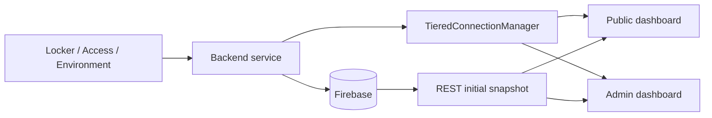

# Realtime Operational Monitoring Dashboard

## Mục đích

Module tổng hợp trạng thái vận hành cho public/admin: occupancy, locker availability, environment, fan, log sự kiện và trạng thái kết nối realtime.

## Thành phần và file

| Layer | Source chính | Vai trò |
|---|---|---|
| ESP32 / Hardware | N/A trực tiếp | Dữ liệu đến từ Locker, Environment và future Door modules |
| Backend | api/routes_public.py, api/websocket.py, main.py | Snapshot REST, WS tiered channels, static mount |
| Firebase | lockers, check_logs, environment_readings, members | Nguồn dữ liệu tổng hợp |
| Frontend | public/app.js, admin/app.js, shared/websocket.js, shared/api.js | Render dashboard và reconnect |

Legacy dashboard tại backend/app/static/dashboard.html cũng dùng REST/WebSocket nhưng không phải primary frontend hiện tại.

## REST snapshot và WebSocket delta

Public dashboard dùng GET /api/public/status và /api/public/lockers lúc khởi tạo. Admin dùng API protected cho overview, lockers, activity, members và environment history. Sau đó shared GymTagWebSocket duy trì kết nối, ping/pong và reconnect.

| Event | Audience | Nguồn |
|---|---|---|
| occupancy_update | public | checkin/checkout handler |
| locker_status_update | public | locker handler/admin locker route |
| locker_event | admin | locker handler/admin locker route |
| checkin_event, checkout_event | admin | access handler |
| environment_update | public + admin | environment handler/admin fan route |
| threshold_update | admin | admin threshold route |

## Flow

Public payload locker được privacy-safe, không có card_id. Admin channel yêu cầu JWT query token; public channel không yêu cầu token. User portal kết nối public channel nhưng sau event sẽ reload dữ liệu cá nhân qua authenticated REST.

## Failure cases

- WebSocket disconnected: client hiển thị trạng thái mất kết nối và reconnect; REST vẫn là snapshot fallback.
- Một event thiếu dữ liệu: UI fallback fetch lại API liên quan.
- Admin token invalid: /ws/admin đóng với policy violation.
- Dữ liệu chưa có environment reading: Public API trả null temperature/humidity và UI hiển thị placeholder.

## Câu hỏi vấn đáp

1. Vì sao cần cả REST và WebSocket?
2. Tại sao public/admin dùng WebSocket tier khác nhau?
3. Vì sao public locker event không chứa card_id?
4. Event nào làm public occupancy đổi?
5. User portal dùng public WebSocket nhưng user REST protected vì sao?
6. Firebase có push trực tiếp tới browser không?
7. Khi WebSocket mất kết nối dashboard có còn lấy snapshot không?
