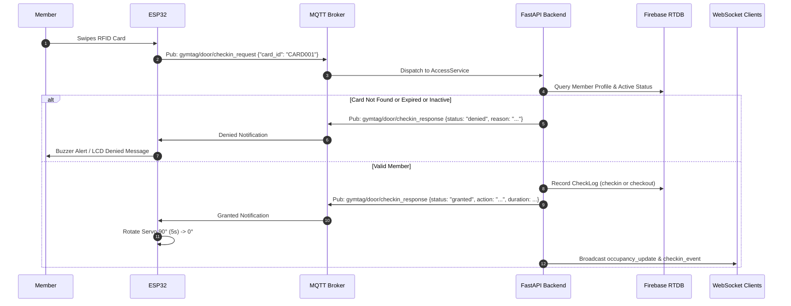
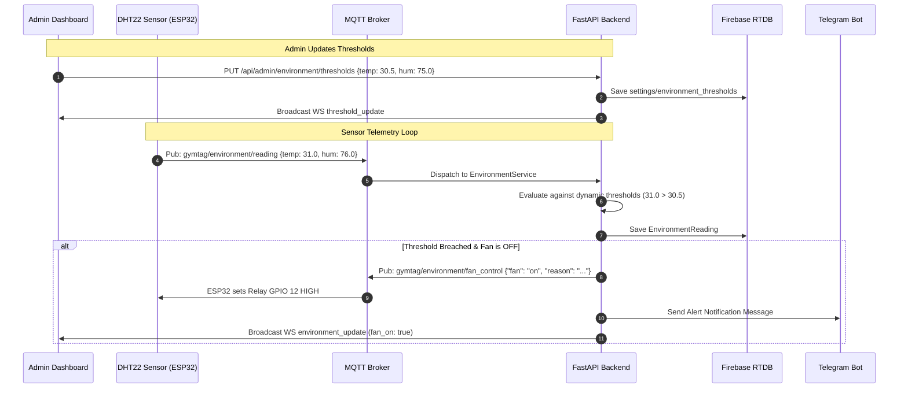

# GymTag System Architecture Documentation

## 1. Overview

**GymTag** is an IoT-based Smart Gym Access and Facility Management Platform designed with a modern, decoupled, asynchronous event-driven architecture.

The platform coordinates edge microcontrollers (ESP32), an asynchronous Python backend (FastAPI), Google Firebase Realtime Database, Telegram Bot notification services, and responsive web portals providing live telemetry via WebSockets.

---

## 2. System Architecture Diagram

```
+-----------------------------------------------------------------------------------+
|                              ESP32 EDGE HARDWARE                                  |
|  - RFID RC522 Reader #1 (Entrance & Exit Door)                                    |
|  - RFID RC522 Reader #2 (Smart Locker Station)                                    |
|  - DHT22 (Temperature & Humidity Sensor - GPIO 15)                                |
|  - Servo Motor (Door Locking Actuator - GPIO 13)                                  |
|  - Relay Module (Ventilation Fan Control - GPIO 12)                               |
|  - LCD 16x2 I2C Display                                                           |
+-----------------------------------------------------------------------------------+
                                         | |
                                 MQTT Protocol (JSON)
                                 Broker: test.mosquitto.org:1883
                                         | |
                                         v v
+-----------------------------------------------------------------------------------+
|                              PYTHON BACKEND SERVICE                               |
|  FastAPI Framework (Python 3.11+)                                                 |
|                                                                                   |
|  +-----------------------------------------------------------------------------+  |
|  | MQTT Handler & Async Bridge (Translates thread MQTT callbacks -> Async IO)  |  |
|  +-----------------------------------------------------------------------------+  |
|                                        |                                          |
|                                        v                                          |
|  +-----------------------------------------------------------------------------+  |
|  |                             SERVICES LAYER                                  |  |
|  |  - AccessService: Check-in / Check-out, Membership Validation, Duration     |  |
|  |  - LockerService: Smart Locker Allocation & Release Logic                   |  |
|  |  - EnvironmentService: Dynamic Thresholds, Automated Fan Control Logic     |  |
|  |  - OccupancyService: Live Facility Head-Count Calculation                   |  |
|  |  - NotificationService: Telegram Bot Emergency Alert Dispatcher            |  |
|  +-----------------------------------------------------------------------------+  |
|                   |                         |                      |              |
|                   v                         v                      v              |
|       +-----------------------+  +---------------------+  +--------------------+  |
|       | Telegram Alert Engine |  |  WebSocket Manager  |  |  Repository Layer  |  |
|       | (httpx Async Client)  |  | (Public / Admin WS) |  | (Firebase RTDB)    |  |
|       +-----------------------+  +---------------------+  +--------------------+  |
+-----------------------------------------------------------------------------------+
                                             | |
                                    REST API & WebSockets
                                             | |
                                             v v
+-----------------------------------------------------------------------------------+
|                               FRONTEND WEB PORTALS                                |
|                                                                                   |
|   +-----------------------+ +-----------------------+ +-----------------------+   |
|   |    PUBLIC MONITOR     | |   MEMBER USER PORTAL  | |  ADMIN CONTROL PANEL  |   |
|   |  - Real-time head count| |  - Member Login & Pwd | |  - Member management  |   |
|   |  - Locker status grid | |  - Personal profile   | |  - Locker force control|  |
|   |  - Live Temp/Humidity | |  - Workout duration   | |  - Dynamic Thresholds |   |
|   |                       | |  - Check-in history   | |  - Manual Fan Toggle  |   |
|   +-----------------------+ +-----------------------+ +-----------------------+   |
+-----------------------------------------------------------------------------------+
```

---

## 3. Core Subsystems & Responsibilities

### 3.1 Edge Hardware Subsystem (ESP32)
- **Entrance Door Access**: Reads RFID UID from RC522 #1, requests authentication from the backend over `gymtag/door/checkin_request`, and actuates the door servo on positive confirmation.
- **Smart Locker Terminal**: Reads RFID UID from RC522 #2, communicates with `gymtag/locker/request`, and prompts locker assignment / release on the LCD.
- **Environment Telemetry**: Reads ambient temperature and relative humidity from DHT22 every 5–10 seconds and publishes readings to `gymtag/environment/reading`.
- **Fan Actuation**: Listens to `gymtag/environment/fan_control` and switches the relay on GPIO 12 HIGH/LOW accordingly.

### 3.2 Messaging & Async Bridge (`app/mqtt/`)
- Uses `paho-mqtt` to maintain persistent connection with the MQTT broker.
- Uses `asyncio.run_coroutine_threadsafe()` to bridge synchronous MQTT client message callbacks seamlessly into FastAPI's asynchronous event loop.

### 3.3 Business Logic Services Layer (`app/services/`)
- **`AccessService`**: Validates card existence, checks account active flag (`is_active`) and membership expiry date. Automatically determines whether an action is a `checkin` or `checkout`. When checking out, computes cumulative workout duration in minutes.
- **`LockerService`**: Manages locker state transitions (`vacant`, `occupied`, `broken`). Ensures one-locker-per-member constraint, assigns the lowest vacant index, releases assigned lockers when returned, and automatically records all locker activity logs (`locker_logs/{uuid}`) to Firebase Realtime Database.
- **`EnvironmentService`**: Evaluates DHT22 readings against dynamic thresholds using a **Hysteresis Deadband** (avoids rapid chattering). If limits are breached, commands fan ON and sends formatted HTML Telegram alerts. Enforces **Admin Manual Override Priority** (manual fan commands strictly take precedence over sensor readings), supports returning to `AUTO` mode, and issues periodic reminder notifications (`ALERT_REMINDER_INTERVAL_MINUTES`).
- **`OccupancyService`**: Derives current facility head-count based on real-time check-in and check-out logs.
- **`NotificationService`**: Dispatches formatted HTML alert messages to Telegram chats via Bot API over a dedicated **IPv4 Transport** (bypassing ISP IPv6 blackholes) and supports optional proxy configurations.

### 3.4 Data & Persistence Layer (`app/repositories/`)
- **`BaseRepository`**: Abstract base class defining all database interactions.
- **`FirebaseRepository`**: Production implementation utilizing the Google Firebase Admin Python SDK to persist members, lockers, check logs, environment history, and dynamic threshold configurations in real time.
- **`InMemoryRepository`**: Test mock implementation used by pytest test suites for fast and isolated unit tests.

### 3.5 Security & 3-Tier Access Control
- **Public Access**: Unauthenticated access to public gym statistics and locker occupancy status (PII like card IDs and timestamps are omitted).
- **User Member Access**: Authenticated via personal JWT tokens generated upon Card ID + password verification (`POST /api/user/login`). Passwords are encrypted using salted `bcrypt` hashing.
- **Admin Access**: Authenticated via Admin JWT tokens generated upon Admin credential verification (`POST /api/admin/login`). Grants full access to member CRUD, locker overrides, system activity logs, manual fan toggles, and threshold adjustments.

### 3.6 Real-Time WebSocket Streaming (`app/api/websocket.py`)
- Maintains isolated connection pools for **Public** and **Admin** clients.
- Public channel receives generalized updates (`occupancy_update`, `locker_status_update`, `environment_update`).
- Admin channel receives privileged events (`checkin_event`, `checkout_event`, `locker_event`, `threshold_update`, `environment_update`).

---

## 4. Key Execution Workflows

### 4.1 RFID Access Verification Workflow



### 4.2 Dynamic Environment Threshold & Automated Fan Control Workflow


